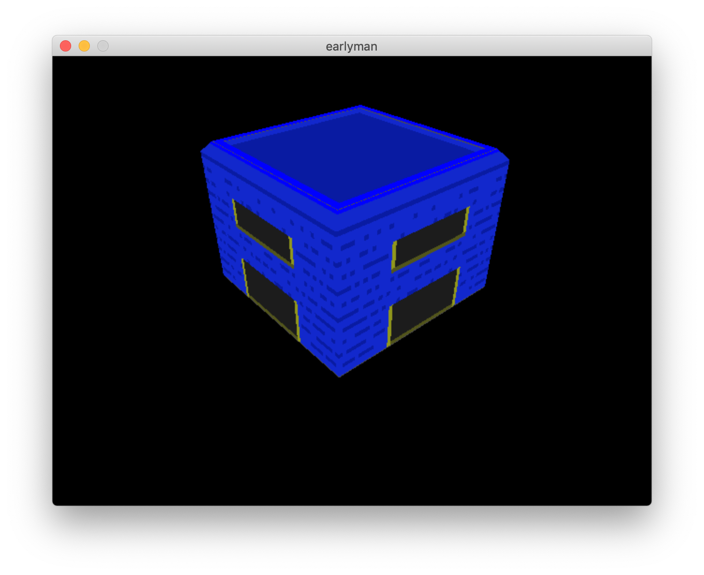

# earlyman
### game engine prototype



A tiny game engine prototype using C++, OpenGL, SDL2, and SQLite. Designed to be run anywhere and built anywhere for ease of casual development and future deployment flexibility. No special IDE, runtime, license, or OS required.

## Mac setup

```
brew install glm                    # tested with version 0.9.9.0
brew install sdl2                   # tested with version 2.0.8
git clone git@github.com:Tencent/rapidjson.git libs/rapidjson
```

if you'd like to run the web (emscripten) version, you'll need to setup emscripten SDK first: http://kripken.github.io/emscripten-site/docs/getting_started/downloads.html

## build and run

### Desktop Mac/Linux

to build: `make`

to run: `./bin/main`

### Web Mac/Linux

to build: `make www`

ro run: `cd www && python -m SimpleHTTPServer 8000` and then open a web browser and load http://localhost:8000

### Desktop Windows

`mingw32-make.exe -f .\WMakefile`

"manual" build command for Windows for reference:

```
x86_64-w64-mingw32-g++.exe -o main.exe .\src\main.cpp -I"C:\Program Files\mingw-w64\x86_64-8.1.0-posix-seh-rt_v6-rev0\mingw64\include" -I".\libs\glm-0.9.9.0\glm" -I".\libs\rapidjson\include" -lmingw32 -lSDL2main -lSDL2 -lopengl32 -lglu32 -lglew32
```

### :snake: Anaconda :snake:

This project shows my interest in maximizing platform flexibility. One of the primary goals of this early prototype of a game engine was to be able to run it everywhere. By using C++ and OpenGL I'll be able to publish to Mac (despite the push to Metal), Linux, Windows, Android (via the NDK), iOS, and even the Web (via emscripten).

I also wanted to make the developer experience working on the engine as frictionless as possible. Coming from Android and iOS development in previous game engines, I didn't want to have to use a special IDE or special OS. You can develop on `earlyman` using your terminal, some standard build tools, and a simple text editor across all three major operating systems.

